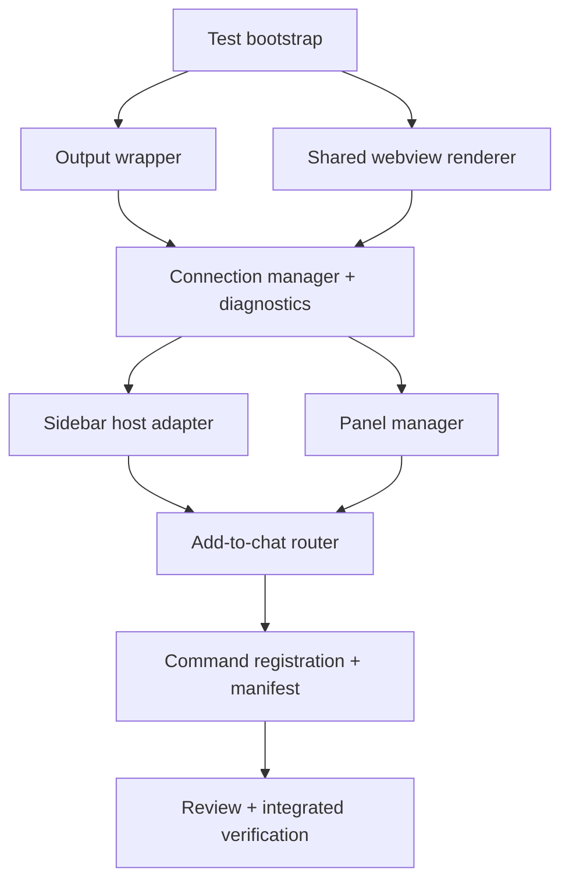

# Implementation Plan: Editor Tabs, Output Diagnostics, and Test Bootstrap

## Overview

Implement three related feature tracks from `docs/`: a minimal Vitest test foundation, an `opencode` VS Code Output channel for diagnostics, and editor-tab chat mode while preserving the existing sidebar view.

The safest implementation order is **test seams first**, then **shared renderer/connection abstractions**, then **panel/routing features**. This avoids concurrent edits to `src/main.ts`, `src/server/ServerManager.ts`, and `src/webview/OpencodeViewProvider.ts` before the shared contracts exist.

## Source Context

| Area | Current state | Plan impact |
| --- | --- | --- |
| `package.json` | Has `compile`/`watch`; no tests; commands only sidebar/add/restart | Add Vitest scripts and new command contributions. |
| `src/main.ts` | Composition root directly creates sidebar provider and `ServerManager`; commands route to one provider | Refactor into shared managers and command routing. |
| `src/server/ServerManager.ts` | Owns process/proxy; directly calls one `OpencodeViewProvider` | Convert or wrap as `OpencodeConnectionManager` with state fan-out and diagnostics. |
| `src/webview/OpencodeViewProvider.ts` | Sidebar-only host; private template rendering/message bridge | Extract renderer/bridge seams usable by sidebar and editor panels. |
| `src/webview/templates/iframe.html` | Hard-coded `max-width: 640px` | Add layout mode for sidebar vs editor. |
| `src/proxy/WebviewProxy.ts` | Starts local proxy; no diagnostics parameter | Add optional lifecycle logger without logging bodies. |

## Architecture Decisions

- **Vitest first:** add fast local tests before feature refactors so implementation agents have immediate feedback.
- **Concrete VS Code mock wiring:** tests that import production files must resolve `import * as vscode from "vscode"` through a Vitest alias/setup mock, not ad hoc per-test hacks.
- **Keep Phase 1 MVP scoped:** do not implement `WebviewPanelSerializer` unless needed for compile/runtime correctness; specs mark it as after MVP/deferred.
- **Use narrow adapters:** introduce interfaces for webview hosts and diagnostics instead of passing raw VS Code objects everywhere.
- **Shared webview bridge before panels:** extract message handling/webview setup once so sidebar and panels do not duplicate clipboard/audio/insert-text behavior.
- **Connection state fan-out replaces direct provider coupling:** all hosts subscribe to `loading | ready | error` state.
- **Privacy boundary is explicit:** diagnostics log lifecycle and sanitized process lines only; never log webview message payloads, chat prompts, selections, audio data, or HTTP bodies.
- **Command compatibility:** keep existing `opencode.toggleChatView` and add required `opencode.toggleChatViewInPanelOrSidebar` alias/forwarder to satisfy the spec without breaking existing users.

## Task List

### Phase 1: Test Foundation and Isolated Diagnostics

#### Task 1: Add Vitest bootstrap

**Description:** Add the minimal automated test runner and VS Code mock foundation required by the specs.

**Acceptance criteria:**

- [ ] `package.json` has `test`, `test:watch`, and `check` scripts.
- [ ] `vitest` is in `devDependencies` and lockfile is updated if present.
- [ ] `vitest.config.ts` can resolve tests under `src/**/*.test.ts`.
- [ ] `vitest.config.ts` and/or setup files provide a concrete mock wiring strategy so `import * as vscode from "vscode"` resolves in unit tests.
- [ ] `src/test/vscodeMock.ts` provides reusable mocks for output channels, commands, window APIs, workspace APIs, env URI/clipboard APIs, webview views/panels, and disposable subscriptions needed by first tests.

**Verification:**

- [ ] `npm test` runs, even if only bootstrap/initial tests exist.
- [ ] `npm run compile` still passes after implementation tasks that add source files.

**Dependencies:** None  
**Estimated size:** S

**Files likely touched:**

- `package.json`
- `package-lock.json` if present/created by npm
- `vitest.config.ts`
- `src/test/setup.ts` if needed
- `src/test/vscodeMock.ts`

---

#### Task 2: Implement and test `OpencodeOutputChannel`

**Description:** Create the diagnostics wrapper and prove basic output behavior plus sanitization.

**Acceptance criteria:**

- [ ] `OpencodeOutputChannel` creates exactly one VS Code output channel named `opencode` through injected/VS Code factory.
- [ ] It exposes `info`, `warn`, `error`, `appendProcessOutput(source, chunk)`, `show`, and `dispose`/disposable behavior.
- [ ] Appended diagnostics include a stable timestamp/prefix format, e.g. `[YYYY-MM-DD HH:mm:ss] [info] ...`.
- [ ] Process chunks are split into safe lines and redacted for likely secret/env patterns (`TOKEN=`, `KEY=`, `SECRET=`, `PASSWORD=`, `AUTH=`, bearer tokens), while preserving useful URL/lifecycle lines.
- [ ] Wrapper tests include BDD scenario comments from the docs.

**Verification:**

- [ ] `npm test -- OpencodeOutputChannel`
- [ ] `npm run compile`

**Dependencies:** Task 1  
**Estimated size:** S

**Files likely touched:**

- `src/diagnostics/OpencodeOutputChannel.ts`
- `src/diagnostics/OpencodeOutputChannel.test.ts`
- `src/test/vscodeMock.ts`

### Checkpoint: Foundation

- [ ] `npm test` passes for bootstrap + output wrapper tests.
- [ ] `npm run compile` passes.
- [ ] Commit recommended: `test/diagnostics foundation`.

---

### Phase 2: Shared Webview Rendering and Host Contract

#### Task 3: Extract shared webview renderer with layout mode

**Description:** Move loading/error/iframe rendering out of `OpencodeViewProvider` into testable helpers that support sidebar and editor layouts.

**Acceptance criteria:**

- [ ] Add `WebviewLayoutMode = "sidebar" | "editor"`.
- [ ] Renderer returns loading HTML, error HTML with/without install hint, and iframe HTML from templates.
- [ ] Sidebar iframe preserves `max-width: 640px` behavior.
- [ ] Editor iframe uses full available width/height with no `max-width: 640px` cap.
- [ ] Tests cover server origin extraction and malformed URL fallback.

**Verification:**

- [ ] `npm test -- webviewRenderer`
- [ ] `npm run compile`

**Dependencies:** Task 1  
**Estimated size:** M

**Files likely touched:**

- `src/webview/webviewRenderer.ts`
- `src/webview/webviewRenderer.test.ts`
- `src/webview/templates/iframe.html` or new renderer-level style replacement
- `src/webview/OpencodeViewProvider.ts`

---

#### Task 4: Extract shared webview bridge and sidebar host adapter

**Description:** Refactor `OpencodeViewProvider` so it remains the sidebar implementation but uses shared webview setup/message bridge code and exposes host operations used by shared routing and connection state.

**Acceptance criteria:**

- [ ] Add a shared `webviewBridge`/setup helper that configures webview options and registers `paste-request`, `copy-request`, and `play-audio` handlers once.
- [ ] Bridge helper provides a safe way to send `insert-text`/`paste-response` back into the iframe for both sidebar and editor hosts.
- [ ] Bridge tests cover clipboard read/write and audio delegation without logging message payloads.
- [ ] Define a shared host shape with id/title/type/last-used/disposed state, `renderState(state)`, `postInsertText(text)`, and `reveal()` where applicable.
- [ ] Sidebar provider uses shared renderer and reports itself as a live host only after `resolveWebviewView`.
- [ ] Existing paste/copy/audio bridge behavior still works and does not log payloads.
- [ ] Existing `opencode.toggleChatView` sidebar behavior is preserved.

**Verification:**

- [ ] Focused tests for sidebar host live/no-host behavior where practical.
- [ ] `npm run compile`

**Dependencies:** Task 3  
**Estimated size:** M

**Files likely touched:**

- `src/webview/OpencodeViewProvider.ts`
- `src/webview/webviewBridge.ts`
- `src/webview/webviewBridge.test.ts`
- `src/webview/webviewHost.ts` or `src/webview/types.ts`
- `src/webview/OpencodeViewProvider.test.ts` if useful

### Checkpoint: Webview Seam

- [ ] `npm test` passes.
- [ ] `npm run compile` passes.
- [ ] Existing sidebar path remains represented in unit tests or compile-level proof.

---

### Phase 3: Connection Manager and Lifecycle Diagnostics

#### Task 5: Convert server lifecycle to connection-state fan-out

**Description:** Introduce `OpencodeConnectionManager` (or evolve `ServerManager` with a new public contract) that owns server/proxy lifecycle and notifies all subscribed hosts.

**Acceptance criteria:**

- [ ] Define `ConnectionState = { type: "loading" } | { type: "ready"; serverUrl: string } | { type: "error"; message: string; showInstallHint: boolean }`.
- [ ] Manager persists/reuses server and proxy ports as current behavior does.
- [ ] Manager rewrites proxy/server URL through `vscode.env.asExternalUri` before ready state.
- [ ] Manager supports subscribe/unsubscribe and immediately renders current state to new hosts.
- [ ] Restart publishes loading and then ready/error to every subscribed host.
- [ ] Existing server reuse and fallback-to-expected-URL behavior remain intact.

**Verification:**

- [ ] `npm test -- OpencodeConnectionManager` or `npm test -- ServerManager`
- [ ] `npm run compile`

**Dependencies:** Tasks 2, 4  
**Estimated size:** M

**Files likely touched:**

- `src/server/OpencodeConnectionManager.ts` or `src/server/ServerManager.ts`
- `src/server/OpencodeConnectionManager.test.ts` or `src/server/ServerManager.test.ts`
- `src/main.ts`

---

#### Task 6: Integrate server/proxy/output diagnostics

**Description:** Wire `OpencodeOutputChannel` into activation, connection lifecycle, and proxy lifecycle without logging private payloads.

**Acceptance criteria:**

- [ ] Activation creates/registers one output wrapper via `context.subscriptions`.
- [ ] `opencode.showOutput` reveals the channel without any chat host open.
- [ ] Server lifecycle logs no-workspace, workspace/cwd label, port choices/reuse, spawn, ready URL detection, restart/stop, missing binary/spawn failure, and non-zero exit.
- [ ] `appendProcessOutput` receives stdout/stderr chunks while URL parsing still works.
- [ ] Proxy lifecycle logs start/reuse/fallback/failure/stop at high level only.
- [ ] No webview message payloads, selections, copied text, audio payloads, env dumps, or request/response bodies are logged.

**Verification:**

- [ ] `npm test -- OpencodeOutputChannel`
- [ ] `npm test -- OpencodeConnectionManager` / server lifecycle tests
- [ ] `npm test -- WebviewProxy` if proxy tests are added
- [ ] `npm run compile`

**Dependencies:** Tasks 2, 5  
**Estimated size:** M

**Files likely touched:**

- `src/main.ts`
- `src/diagnostics/OpencodeOutputChannel.ts`
- `src/server/OpencodeConnectionManager.ts` or `src/server/ServerManager.ts`
- `src/proxy/WebviewProxy.ts`
- Relevant `*.test.ts`

### Checkpoint: Connection + Diagnostics

- [ ] `npm test` passes.
- [ ] `npm run compile` passes.
- [ ] Output diagnostics work at code level without a sidebar/editor host.
- [ ] Commit recommended: `connection diagnostics`.

---

### Phase 4: Editor Panels and Add-to-Chat Routing

#### Task 7: Implement `OpencodePanelManager`

**Description:** Add editor-tab chat panels that subscribe to the shared connection manager and use the shared renderer/bridge.

**Acceptance criteria:**

- [ ] `openChat` creates a new `WebviewPanel` in the active editor column.
- [ ] `openChatBeside` creates a new `WebviewPanel` in `vscode.ViewColumn.Beside`.
- [ ] Repeated opens create distinct panel records with unique ids/titles.
- [ ] Closing one panel disposes only that host and does not stop the shared connection.
- [ ] Active/recent tracking updates on panel active changes and message sends.
- [ ] Panels render `loading`, `ready`, and `error` states from the connection manager.

**Verification:**

- [ ] `npm test -- OpencodePanelManager`
- [ ] `npm run compile`

**Dependencies:** Tasks 3, 4, 5  
**Estimated size:** M

**Files likely touched:**

- `src/panels/OpencodePanelManager.ts`
- `src/panels/OpencodePanelManager.test.ts`
- `src/webview/webviewHost.ts` or shared host types
- `src/main.ts`

---

#### Task 8: Implement add-to-chat target routing

**Description:** Route file/selection references to zero/one/multiple live hosts according to the spec.

**Acceptance criteria:**

- [ ] Add a routing helper/service for live sidebar + panel hosts.
- [ ] Zero hosts: show notification such as “Start opencode chat first.” and do not throw.
- [ ] One host: send directly with no quick pick.
- [ ] Multiple hosts: show quick-pick with default `last used (...)` plus concrete hosts sorted by last-used descending.
- [ ] File reference formatting remains current behavior via `vscode.workspace.asRelativePath`.
- [ ] Selection reference formatting remains stable for cursor-only, single-line, and multi-line selections.
- [ ] Routed text is never logged to Output diagnostics.

**Verification:**

- [ ] `npm test -- addToChat` or `npm test -- OpencodePanelManager`
- [ ] `npm run compile`

**Dependencies:** Tasks 4, 7  
**Estimated size:** M

**Files likely touched:**

- `src/commands/addToChat.ts`
- `src/commands/addToChat.test.ts`
- `src/panels/OpencodePanelManager.ts`
- `src/webview/OpencodeViewProvider.ts`
- `src/main.ts`

---

#### Task 9: Register commands and update manifest contributions

**Description:** Wire new commands into activation and `package.json` while preserving existing command IDs.

**Acceptance criteria:**

- [ ] `package.json` contributes `opencode.openChat`, `opencode.openChatBeside`, and `opencode.showOutput`.
- [ ] Existing `opencode.toggleChatView`, `opencode.restart`, `opencode.addToChat`, and `opencode.addSelectionToChat` remain contributed.
- [ ] `package.json` contributes `opencode.toggleChatViewInPanelOrSidebar` as a required alias/forwarder for existing sidebar toggle behavior.
- [ ] Activation registers every contributed command.
- [ ] `opencode.restart` restarts the shared connection and refreshes all hosts.

**Verification:**

- [ ] Manifest/command test asserts required commands are contributed/registered where practical.
- [ ] `npm test`
- [ ] `npm run compile`

**Dependencies:** Tasks 6, 7, 8  
**Estimated size:** S

**Files likely touched:**

- `package.json`
- `src/main.ts`
- `src/main.test.ts` or `src/commands/*.test.ts`

### Checkpoint: Feature Complete in Code

- [ ] `npm test` passes.
- [ ] `npm run compile` passes.
- [ ] `npm run check` passes.
- [ ] Commit recommended: `editor tabs and routing`.

---

### Phase 5: Manual Verification, Documentation, and Finalization

#### Task 10: Manual Extension Development Host smoke pass

**Description:** Run or document real VS Code verification for behavior that unit tests cannot prove.

**Acceptance criteria:**

- [ ] `opencode.openChat` opens editor tabs; repeated calls create multiple tabs.
- [ ] `opencode.openChatBeside` opens beside the active editor.
- [ ] Existing sidebar toggle still opens/toggles the sidebar view.
- [ ] Add-to-chat behavior is checked with zero, one, and multiple hosts.
- [ ] Restart shows loading/ready/error across open hosts.
- [ ] Output panel has `opencode`; `opencode.showOutput` reveals it.
- [ ] Output diagnostics are inspected for privacy boundaries.

**Verification:**

- [ ] Record evidence/caveats from manual tests in final report or a docs note.

**Dependencies:** Task 9  
**Estimated size:** S/M depending on environment

**Files likely touched:**

- None required, unless docs need updates.

---

#### Task 11: Update `AGENTS.md` with implementation notes

**Description:** Add final notes requested by the user so future agents understand the new architecture/test commands.

**Acceptance criteria:**

- [ ] `AGENTS.md` mentions new test commands and high-level feature architecture.
- [ ] Notes are concise and do not duplicate full specs.

**Verification:**

- [ ] Read `AGENTS.md` update and confirm it matches final code.

**Dependencies:** Task 9, preferably after verification findings are known  
**Estimated size:** XS

**Files likely touched:**

- `AGENTS.md`

## Test Coverage Plan

| Behavior | Automated proof | Manual proof |
| --- | --- | --- |
| Output wrapper create/append/show/sanitize | `src/diagnostics/OpencodeOutputChannel.test.ts` | Output panel reveal smoke |
| Webview loading/error/iframe layout | `src/webview/webviewRenderer.test.ts` | Sidebar/editor visual layout smoke |
| Connection state fan-out/restart | `src/server/OpencodeConnectionManager.test.ts` | Restart with multiple hosts |
| Proxy lifecycle diagnostics | `src/proxy/WebviewProxy.test.ts` if feasible; otherwise server integration tests | Output inspection during startup/fallback |
| Panel creation/disposal/recent tracking | `src/panels/OpencodePanelManager.test.ts` | Open/move/split/close editor tabs |
| Add-to-chat zero/one/multiple routing | `src/commands/addToChat.test.ts` | Context menu/editor selection smoke |
| Command contributions | `src/main.test.ts` or manifest assertion test | Command palette smoke |

## Risks and Mitigations

| Risk | Impact | Mitigation |
| --- | --- | --- |
| Refactor breaks sidebar behavior | High | Extract renderer first; keep sidebar provider adapter; compile/test after each phase. |
| Tests over-mock VS Code and miss runtime issues | Medium | Keep manual Extension Development Host smoke as required proof. |
| Output sanitization is under-specified | Medium | Implement conservative redaction for likely secrets/env assignments and never pass private payloads to logger. |
| Connection manager task grows too large | High | Preserve existing `ServerManager` logic where possible; add state fan-out and injected diagnostics rather than rewriting process/proxy behavior wholesale. |
| Multiple agents conflict in shared files | High | Sequence implementation tasks that touch `main.ts`, server, and provider; only parallelize isolated tests/reviews after seams exist. |
| `WebviewPanelSerializer` scope creep | Medium | Defer for Phase 1 unless explicitly required by review/compile; document as follow-up. |

## Open Questions Resolved for Implementation

- **Timestamp format:** use local ISO-ish timestamps (`YYYY-MM-DD HH:mm:ss`) in diagnostics for readability.
- **Sanitization baseline:** redact likely env/secret assignments and bearer-like tokens; do not log private payloads at the call sites.
- **Default chat command:** add editor open commands but preserve sidebar toggle command compatibility.
- **Panel serialization:** defer from MVP.

## Execution Rules for Subagents

- Do not run concurrent implementation agents against the same shared files.
- Each implementation subagent should use `incremental-implementation` and `test-driven-development` where adding tests.
- Each subagent must return: files changed, tests run, command output summary, blockers, and follow-up risks.
- After every checkpoint, run integrated verification before starting dependent tasks.
- After implementation, run fresh code review/business-logic review before final verification.
