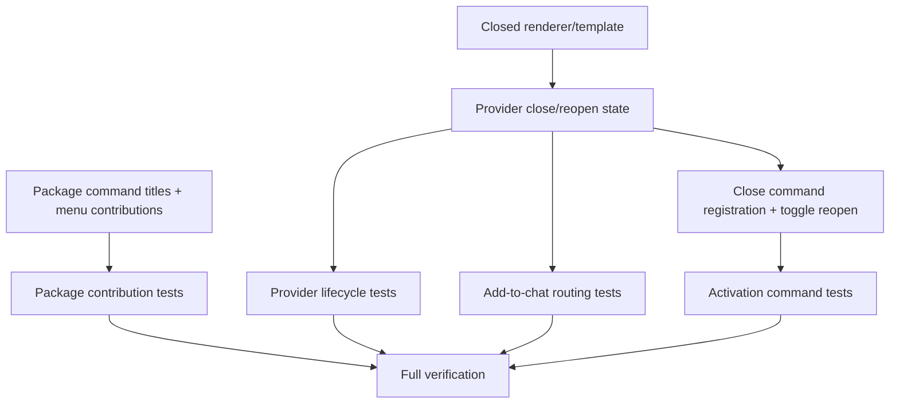

# Implementation Plan: Action Naming and Sidebar Chat Controls

## Overview

Implement the action naming cleanup and sidebar chat controls from the high-level spec. Keep existing command IDs stable, add a sidebar `view/title` toolbar action for opening a new editor chat and closing the sidebar chat, and introduce sidebar-only closed state that unloads the sidebar iframe without stopping the shared opencode server or affecting editor-tab hosts.

## Project/Scope Estimate

| Scope | Size |
| --- | ---: |
| Repository TypeScript | ~3.3k lines |
| Primary files likely touched | 5-8 files |
| Ceremony | Medium |

## Architecture Decisions

- **Command IDs remain stable.** Only titles/menus change, plus one new command ID: `opencode.closeSidebarChat`.
- **Remove the duplicate sidebar toggle alias.** `opencode.toggleChatView` is the single sidebar toggle command.
- **Sidebar closed state belongs in `OpencodeViewProvider`.** This is UI-host state, not shared server connection state.
- **Closed state is not a `WebviewRenderState`.** Server connection state remains `loading | ready | error`; use a separate closed renderer/template helper.
- **Add-to-chat routing uses existing live-host filtering.** Closing the sidebar makes `isLiveHost === false`, so routing naturally omits it.
- **Reopen is explicit.** Sidebar connection updates should not resurrect the iframe; `toggleChatView` after close is treated as the explicit reopen action.

## Dependency Graph

## Task List

### Task 1: Manifest naming and toolbar contributions

**Description:** Update `package.json` command titles, contribute `opencode.closeSidebarChat`, add sidebar `view/title` actions, and remove the duplicate sidebar toggle alias.

**Acceptance criteria:**

- [ ] Existing command IDs have the titles specified by the spec.
- [ ] `opencode.closeSidebarChat` is contributed with title `opencode: Close Sidebar Chat` and close icon.
- [ ] `view/title` contains scoped entries for `opencode.openChat` and `opencode.closeSidebarChat` with `when: "view == opencode.chatView"`.
- [ ] Only one sidebar toggle command is contributed and registered.

**Verification:**

- [ ] Focused package contribution tests pass.
- [ ] `npm run compile` accepts the manifest/template setup.

**Dependencies:** None  
**Estimated size:** S  
**Files likely touched:**

- `package.json`
- `src/packageContributions.test.ts` or `src/main.test.ts`

---

### Task 2: Closed sidebar renderer/template

**Description:** Add a lightweight closed webview template/helper that renders no opencode iframe.

**Acceptance criteria:**

- [ ] Closed HTML contains no `<iframe>` and no server URL.
- [ ] Closed renderer is separate from shared server connection render state.
- [ ] Template is covered by existing compile/template-copy flow.

**Verification:**

- [ ] `npm test -- src/webview/webviewRenderer.test.ts`

**Dependencies:** None  
**Estimated size:** S  
**Files likely touched:**

- `src/webview/webviewRenderer.ts`
- `src/webview/templates/closed.html`
- `src/webview/webviewRenderer.test.ts`

---

### Task 3: Sidebar provider close/reopen lifecycle

**Description:** Add sidebar-only closed state to `OpencodeViewProvider`. Closing unloads the iframe/bridge and makes the host non-live. Connection updates save state but keep rendering closed HTML. Reopen renders the latest connection state and restores liveness.

**Acceptance criteria:**

- [ ] `closeChat()` unloads iframe HTML and disposes/removes the webview bridge.
- [ ] `isLiveHost` is false while closed.
- [ ] Connection state updates do not resurrect iframe while closed.
- [ ] `reopenChat()` renders the latest saved ready/loading/error state.
- [ ] Closing does not dispose the `WebviewView` or the provider.

**Verification:**

- [ ] `npm test -- src/webview/OpencodeViewProvider.test.ts`

**Dependencies:** Task 2  
**Estimated size:** M  
**Files likely touched:**

- `src/webview/OpencodeViewProvider.ts`
- `src/webview/OpencodeViewProvider.test.ts`

---

### Task 4: Command registration and explicit reopen wiring

**Description:** Register `opencode.closeSidebarChat` in activation and update sidebar toggle behavior so a closed sidebar chat is explicitly reopened before focusing the sidebar view.

**Acceptance criteria:**

- [ ] `opencode.closeSidebarChat` command is registered.
- [ ] Close command calls only provider close behavior; it does not stop/restart shared server/proxy.
- [ ] `opencode.toggleChatView` reopens a closed sidebar chat using current provider state.
- [ ] `opencode.openChat` still creates a new editor-tab chat and does not mutate sidebar state.

**Verification:**

- [ ] `npm test -- src/main.test.ts`

**Dependencies:** Task 3  
**Estimated size:** S/M  
**Files likely touched:**

- `src/main.ts`
- `src/main.test.ts`
- `src/test/vscodeMock.ts` only if existing mocks are insufficient

---

### Task 5: Add-to-chat routing coverage after sidebar close

**Description:** Prove existing live-host routing omits closed sidebar hosts and routes correctly to editor hosts.

**Acceptance criteria:**

- [ ] Closed sidebar as the only host behaves as “no live host”.
- [ ] Closed sidebar plus one live editor host routes directly to the editor.
- [ ] Closed sidebar plus multiple editor hosts shows a picker containing editor hosts only.
- [ ] No `insert-text` message is posted to the closed sidebar.

**Verification:**

- [ ] `npm test -- src/commands/addToChat.test.ts`

**Dependencies:** Task 3  
**Estimated size:** S  
**Files likely touched:**

- `src/commands/addToChat.test.ts`

---

### Task 6: Integrated verification and review loop

**Description:** Run focused and full checks, fix failures, then perform fresh-context review and manual/runtime smoke where practical for VS Code-facing behavior.

**Acceptance criteria:**

- [ ] Focused package/provider/routing/activation tests pass.
- [ ] `npm test`, `npm run compile`, and `npm run check` pass.
- [ ] Reviewer finds no blocking business-logic or code-quality issues.
- [ ] Manual/runtime caveats are documented if full Extension Development Host verification is not possible.

**Verification:**

- [ ] `npm test`
- [ ] `npm run compile`
- [ ] `npm run check`

**Dependencies:** Tasks 1-5  
**Estimated size:** M  
**Files likely touched:** None unless fixes are required

## Parallelization Plan

To avoid conflicts, implementation should be mostly sequential:

| Phase | Agent assignment | Reason |
| --- | --- | --- |
| 1 | Manifest + package tests | Independent foundation; low source overlap |
| 2 | Renderer + provider lifecycle + tests | Provider depends on closed renderer |
| 3 | Main command wiring + add-to-chat tests | Depends on provider API/liveness semantics |
| 4 | Verification/review/manual smoke | Needs integrated code |

Avoid running multiple writers against `OpencodeViewProvider.ts`, `main.ts`, or the same test files concurrently.

## Test Strategy

Automate deterministic behavior with Vitest:

- Package contribution titles, duplicate visible palette entries, `view/title` actions.
- Activation command registration and editor-chat open behavior.
- Sidebar provider closed state, no iframe resurrection, explicit reopen.
- Add-to-chat live-host routing with closed sidebar omitted.

Manual/runtime checks remain appropriate for actual VS Code toolbar rendering, icon placement, real Command Palette visuals, Chromium iframe process teardown, and full opencode server end-to-end behavior.

## Risks and Mitigations

| Risk | Impact | Mitigation |
| --- | --- | --- |
| Duplicate sidebar toggle command remains somewhere | Duplicate visible palette title or command surface confusion | Verify package contributions and activation registrations contain only `opencode.toggleChatView` |
| Connection updates recreate sidebar bridge/iframe after close | Spec violation and routing bug | Keep `_closed` gate in provider render path and test loading→ready updates |
| Reopen creates duplicate message handlers | Duplicate add-to-chat posts/listeners | Dispose bridge on close; recreate once on reopen; add lifecycle tests where feasible |
| Tests overfit private state | Brittle suite | Prefer observable webview HTML, registered commands, and host liveness |

## Checkpoints

### Checkpoint A: Contributions

- [ ] Package contribution tests pass.

### Checkpoint B: Sidebar lifecycle

- [ ] Renderer/provider tests pass.

### Checkpoint C: Integrated behavior

- [ ] Main and add-to-chat tests pass.

### Checkpoint D: Complete

- [ ] Full `npm run check` passes.
- [ ] Fresh review completed and findings addressed.
- [ ] Manual/runtime verification completed or caveats documented.
